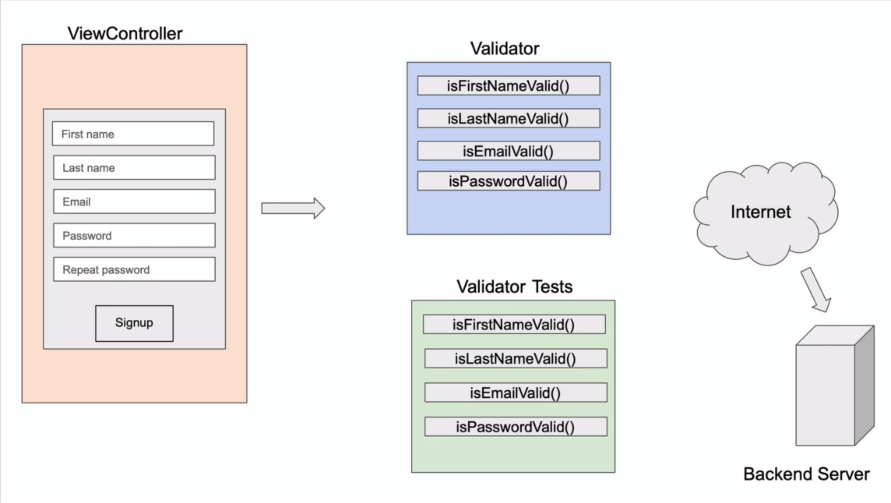

# TDD - Implementing Model Validator

Introduction 

### TDD 방식으로 회원가입 검증기 만들기

* 회원가입 폼은 firstname, lastname, email, password, repeat password로 구성되어있다
* 이 폼을 테스트를 먼저 작성한 뒤 실제 코드를 작성하는 방식으로 구현해볼 것이다.

---

