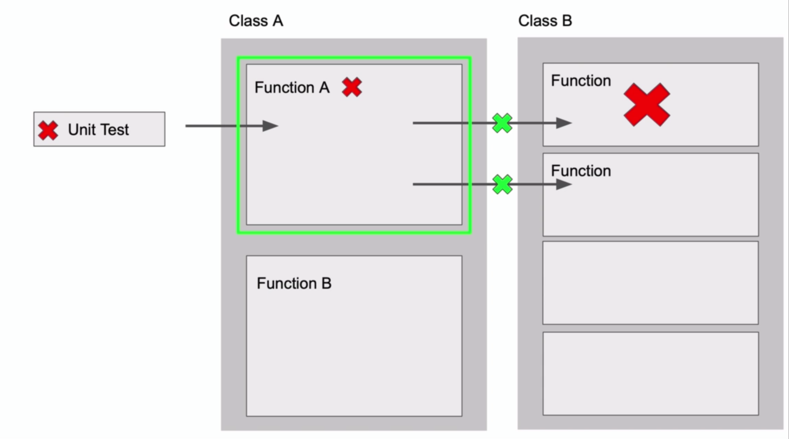

# Test code in isolation

테스트와 격리

* Class A의 function a1를 테스트하는 상황을 가정해보자
* 테스트가 실패하는데 문제는 function a가 의존중인 Class B의 function b1, b2가 실패하고 있기 때문이었다
* 본질적으로 테스트하고 싶었던 대상은 함수 a1인데 함수 a1이 의존중인 다른 객체로부터 영향을 받는 것은 바람직하지 않다
* 이런 상황을 해결하기 위해 격리하는 방법을 알아둘 필요가 있다