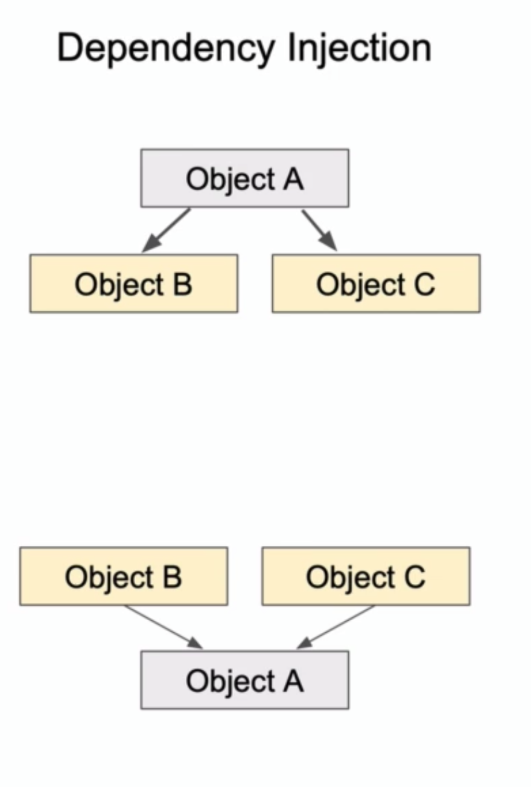
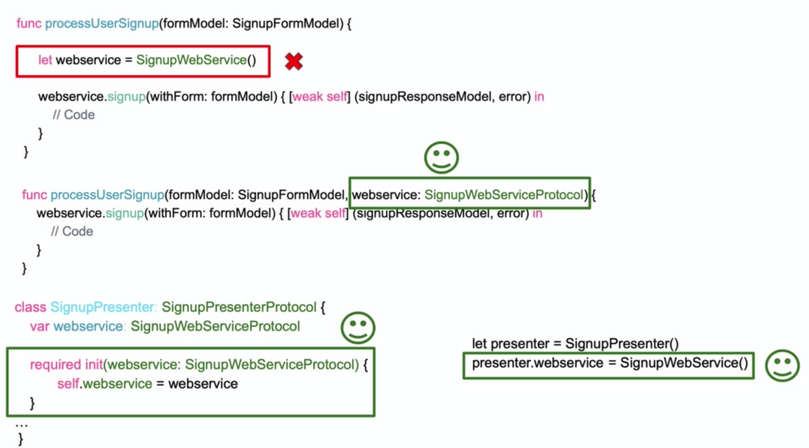

# Test code in isolation

테스트와 격리


* Class A의 function a1를 테스트하는 상황을 가정해보자
* 테스트가 실패하는데 문제는 function a가 의존중인 Class B의 function b1, b2가 실패하고 있기 때문이었다
* 본질적으로 테스트하고 싶었던 대상은 함수 a1인데 함수 a1이 의존중인 다른 객체로부터 영향을 받는 것은 바람직하지 않다
* 이런 상황을 해결하기 위해 격리하는 방법을 알아둘 필요가 있다

---

의존성 주입(Dependency Injection) 


* 일반적으로 객체 A가 객체 B, 객체 C에 의존하는 경우 객체 A안에서 B, C의 인스턴스를 생성해 소유한다
* 의존성 주입은 반대로 외부에서 생성된 객체 B, C를 A가 필요에 따라 주입받는 형태로 구현한다
* 이렇게하면 객체 A와 B, C 사이에 결합도가 줄어들어 보다 테스트하기 쉬운 코드를 작성할 수 있다


* 그리고 객체 A의 테스트를 위해서 실제 객체 B와 객체 C를 매번 신경쓰는 것은 불필요하다
* 따라서 mock 혹은 fake 객체와 stub 메서드를 이용해서 테스트를 수행한다
* '격리'란 이렇게 객체 B, C에 영향을 받지 않고 객체 A만 테스트하는 것을 의미한다

예시 


* 테스트하려는 함수에 웹서비스 객체가 필요할 때, 함수 내에서 직접 생성하지 않고 인자로 프로토콜을 이용해서 유연하게 구현해야 한다
* 멤버변수로 특정객체를 소유해야 할 때는 생성자 혹은 프로퍼티에 특정 프로토콜을 따르는 객체를 주입받도록 구현한다

---

프로토콜 사용하기(Use of Protocols)

의존성 주입으로 격리된 테스트 환경을 구축하기 위해 프로토콜을 잘 사용해야 한다
* 프로토콜은 메서드나 프로퍼티, 그 외의 여러 요구사항들의 블루프린트를 작성해놓는 객체다

```swift
protocol SignupModelValidatorProtocol {
    func isFirstNameValid(firstName: String) -> Bool
    func isValidEmailFormat(email: String) -> Bool
    func isValidPasswordLength(password: String) -> Bool
}
```
* 앞서 구현했던 테스트들의 프로토콜을 작성하면 위와 같을 것이다
* 이 프로토콜을 따르면 반드시 나열된 조건들을 충족하도록 실제로 아래와 같이 구현해야 한다

```swift
class SignupModelSimpleValidator: SignupModelValidatorProtocol {
    func isFirstNameValid(firstName: String) -> Bool {
        // Code here
        return returnValue
    }

    func isValidEmailFormat(email: String) -> Bool {
        // Code here
        return returnValue
    }

    func isValidPasswordLength(password: String) -> Bool {
        // Code here
        return returnValue
    }
}
```

프로토콜을 따르는 목 객체를 만들어 격리하기

```swift
protocol SignupWebServiceProtocol {
    func signup(withForm formModel: SignupFormModel, completionHandler: @escaping (SignupResponseModel?, SignupErrors?) -> Void)
}

class SignupWebServiceMock: SignupWebServiceProtocol {
    func signup(withForm formModel: SignupFormModel, completionHandler: @escaping (SignupResponseModel?, SignupErrors?) -> Void) {
        completionHandler(SignupResponseModel(status: "ok"), nil)
    }
}
```
* 목 객체는 SignupResponseModel이라는 외부 객체를 생성할 때 항상 성공하도록 하드코딩된 값으로 생성하고 있다
* 이 객체를 주입해서 테스트하면 의존관계인 실제 서비스 객체의 실패 여부와 무관하게 테스트하려는 대상에 집중할 수 있다

```swift
let signupWebServiceMock = SignupWebServiceMock()
signupPresenter.processUserSignup(formModel: formModel, webservice: signupWebServiceMock) // Inject mock

func processUserSignup(formModel: SignupFormModel, webservice: SignupWebServiceProtocol) {
    webservice.signup(withForm: formModel) { [weak self] (signupResponseModel, error) in
        // Code
    }
}
```
