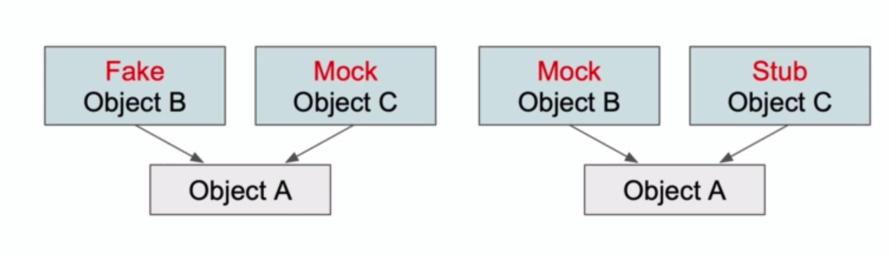

# Test code in isolation

테스트와 격리


* Class A의 function a1를 테스트하는 상황을 가정해보자
* 테스트가 실패하는데 문제는 function a가 의존중인 Class B의 function b1, b2가 실패하고 있기 때문이었다
* 본질적으로 테스트하고 싶었던 대상은 함수 a1인데 함수 a1이 의존중인 다른 객체로부터 영향을 받는 것은 바람직하지 않다
* 이런 상황을 해결하기 위해 격리하는 방법을 알아둘 필요가 있다

---

의존성 주입(Dependency Injection) 


* 일반적으로 객체 A가 객체 B, 객체 C에 의존하는 경우 객체 A안에서 B, C의 인스턴스를 생성해 소유한다
* 의존성 주입은 반대로 외부에서 생성된 객체 B, C를 A가 필요에 따라 주입받는 형태로 구현한다
* 이렇게하면 객체 A와 B, C 사이에 결합도가 줄어들어 보다 테스트하기 쉬운 코드를 작성할 수 있다


* 그리고 객체 A의 테스트를 위해서 실제 객체 B와 객체 C를 매번 신경쓰는 것은 불필요하다
* 따라서 mock, fake, dummy, stub 메서드를 이용해서 테스트를 수행한다
* '격리'란 이렇게 객체 B, C에 영향을 받지 않고 객체 A만 테스트하는 것을 의미한다

예시 


* 테스트하려는 함수에 웹서비스 객체가 필요할 때, 함수 내에서 직접 생성하지 않고 인자로 프로토콜을 이용해서 유연하게 구현해야 한다
* 멤버변수로 특정객체를 소유해야 할 때는 생성자 혹은 프로퍼티에 특정 프로토콜을 따르는 객체를 주입받도록 구현한다

---

프로토콜 사용하기(Use of Protocols)

의존성 주입으로 격리된 테스트 환경을 구축하기 위해 프로토콜을 잘 사용해야 한다
* 프로토콜은 메서드나 프로퍼티, 그 외의 여러 요구사항들의 블루프린트를 작성해놓는 객체다

```swift
protocol SignupModelValidatorProtocol {
    func isFirstNameValid(firstName: String) -> Bool
    func isValidEmailFormat(email: String) -> Bool
    func isValidPasswordLength(password: String) -> Bool
}
```
* 앞서 구현했던 테스트들의 프로토콜을 작성하면 위와 같을 것이다
* 이 프로토콜을 따르면 반드시 나열된 조건들을 충족하도록 실제로 아래와 같이 구현해야 한다

```swift
class SignupModelSimpleValidator: SignupModelValidatorProtocol {
    func isFirstNameValid(firstName: String) -> Bool {
        // Code here
        return returnValue
    }

    func isValidEmailFormat(email: String) -> Bool {
        // Code here
        return returnValue
    }

    func isValidPasswordLength(password: String) -> Bool {
        // Code here
        return returnValue
    }
}
```

프로토콜을 따르는 목 객체를 만들어 격리하기

```swift
protocol SignupWebServiceProtocol {
    func signup(withForm formModel: SignupFormModel, completionHandler: @escaping (SignupResponseModel?, SignupErrors?) -> Void)
}

class SignupWebServiceMock: SignupWebServiceProtocol {
    func signup(withForm formModel: SignupFormModel, completionHandler: @escaping (SignupResponseModel?, SignupErrors?) -> Void) {
        completionHandler(SignupResponseModel(status: "ok"), nil)
    }
}
```
* 목 객체는 SignupResponseModel이라는 외부 객체를 생성할 때 항상 성공하도록 하드코딩된 값으로 생성하고 있다
* 이 객체를 주입해서 테스트하면 의존관계인 실제 서비스 객체의 실패 여부와 무관하게 테스트하려는 대상에 집중할 수 있다

```swift
let signupWebServiceMock = SignupWebServiceMock()
signupPresenter.processUserSignup(formModel: formModel, webservice: signupWebServiceMock) // Inject mock

func processUserSignup(formModel: SignupFormModel, webservice: SignupWebServiceProtocol) {
    webservice.signup(withForm: formModel) { [weak self] (signupResponseModel, error) in
        // Code
    }
}
```

---

테스트 더블 - 페이크, 목, 스텁, 더미(Test Doubles - Fake, Mock, Stub, Dummy)

테스트 더블이란?
* 테스트 더블은 테스트를 진행하기 어려운 경우 이를 대신해 테스트를 진행할 수 있도록 만들어주는 객체를 말한다
* 테스트 더블로 사용되는 객체의 성격에 따라 페이크, 목, 스텁, 더미라고 불린다

페이크(Fake)
* 페이크는 데이터베이스 같은 영속성 처리 작업을 대체해주는 임시 인메모리 객체다
* 영속성 처리가 포함된 메서드를 테스트를 하기 위해 실제 데이터베이스를 구축하고 객체를 생성하는 것은 매우 성가신 일이다
* 따라서 임시적으로 객체를 생성해서 테스트하려는 함수 본래의 목적에 집중할 수 있도록 사용하는 것이 페이크다

더미(Dummy)
* 임시값을 저장해두는 일종의 플레이스홀더(Placeholder) 객체다

```swift
let mockSignup = MockSignupWebService()

mockSignup.signupUser(SignupFormModelDummy())
mockSignup.signupUser(SignupFormModelDummy())
mockSignup.signupUser(SignupFormModelDummy())
mockSignup.signupUser(SignupFormModelDummy())

struct SignupFormModelDummy: SignupFormModelProtocol {
    var firstName = "abc"
    var lastName = "abc"
    var email = "abc"
    var password = "abc"    
}
```
* mockSignup.signupUser()의 인자처럼 특정 객체를 생성할 때 프로퍼티의 지정이 필요한 객체가 있다
* 테스트를 위해 매번 인자를 실제로 입력하는 일은 테스트의 본래 목적과는 관계가 없다
* SignupFormModelDummy 같은 더미 객체에 특정 임시값을 저장해두면 테스트하여 불필요한 작업을 최소화시킬 수 있다

스텁(Stub)
* 더미 객체와 유사하지만 실제 데이터처럼 사용되거나 검증(validate)용으로 사용될 수 있다는 점이 다르다
* 스텁의 목적은 시스템이 특정 방식으로 동작하도록 만드는 것이다. 아래 예시를 보자

```swift
class ValidSignupFormModelValidatorStub {

    func isFirstNameValid(firstName: String) -> Bool {
        return true
    }

    func isLastNameValid(lastName: String) -> Bool {
        return true
    }

    func isValidEmailFormat(email: String) -> Bool {
        return true
    }
}
```
* 이 스텁 메서드의 검증 함수들은 항상 true를 리턴한다
* 이 스텁 메서드를 사용하면 검증용 객체를 의존성으로 가지는 경우 실제 검증 결과에 관계없이 테스트를 진행할 수 있다

목(Mock)
* 목은 페이크와 유사하지만, 간단한 implements조차 제공하지 않을 수 있는 객체다

```swift
class SignupWebServiceMock: SignupWebServiceProtocol {
    func signup(withForm formModel: SignupFormModel, completionHandler: @escaping (SignupResponseModel?, SignupErrors?) -> Void) {
        completionHandler(SignupResponseModel(status: "ok"), nil)
    }
}

class MockSignupWebService: SignupWebServiceProtocol {

    var processUserSignupCalled = false
    var processUserSignupCalledNumberOfTimes = 0

    func processUserSignup(formModel: SignupFormModel) {
        processUserSignupCalled = true
        processUserSignupCalledNumberOfTimes += 1
    }
}
```
* 앞서 예시로 들었던 SignupWebServiceMock의 signup은 completionHandler 같은 단순한 구현조차 생략할 수 있다

---