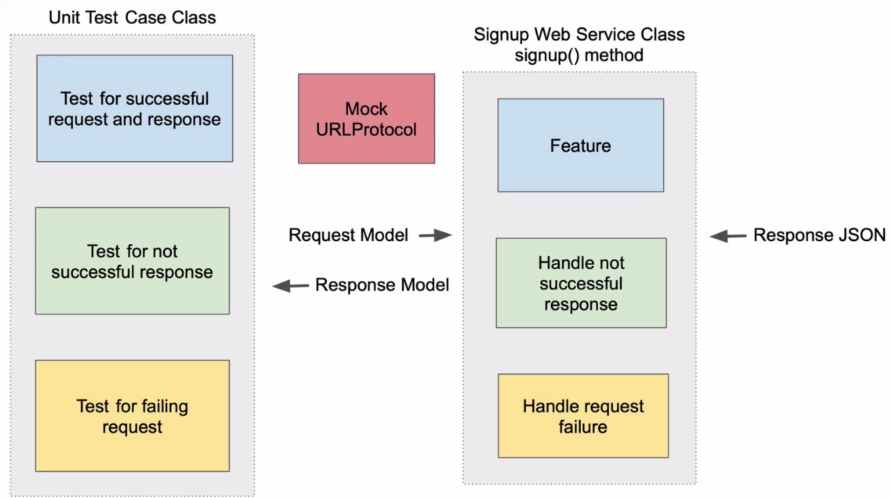

# TDD. Implementing Network Service Class

Intro
* 네트워크 통신을 하는 서비스 객체의 유닛 테스트를 작성해볼 것이다
* 유닛 테스트는 통합 테스트와 달리 실제 네트워크 통신을 하지 않는다
* 그 대신 목 객체로 대체용 응답결과를 제공할 것이다. 
* 실제로 어떻게 프로토콜을 활용해 목을 생성하는지 알아보자


* URLProtocol을 모킹해서 서비스 메서드가 실제로 네트워크 통신을 하지 않고 요청, 응답 성공 실패에 따른 테스트를 가능하게 만들어볼 것이다

---

Create Initial SignupWebServiceTests Unit Test class

SignupWebService 클래스 작성하기
* SignupWebService는 유저 정보들을 보내서 회원가입하는 클래스다
* 실제 구현에는 특정 엔드포인트에 대한 HTTP Request, Response handling이 포함된다
* TDD 방식으로 우선 테스트 클래스를 생성한 뒤 실제 객체를 완성해보자

```swift
import XCTest

class SignupWebServiceTests: XCTestCase {

    override func setUpWithError() throws {
        // Put setup code here. This method is called before the invocation of each test method in the class.
    }

    override func tearDownWithError() throws {
        // Put teardown code here. This method is called after the invocation of each test method in the class.
    }
}
```

---

Create Initial SignupWebService Class

```swift
import XCTest

class SignupWebServiceTests: XCTestCase {

    override func setUpWithError() throws {
        // Put setup code here. This method is called before the invocation of each test method in the class.
    }

    override func tearDownWithError() throws {
        // Put teardown code here. This method is called after the invocation of each test method in the class.
    }

    func testSignupWebService_WhenGivenSuccessfulResponse_ReturnsSuccess() {
        // Arrange
        let sut = SignupWebService()
        
        // Act
        
        // Assert
    }
}
```
* 우선 SignupWebService가 회원가입에 성공했다는 응답을 받았을 때를 테스트하는 메서드를 생성해보자
* 테스트 대상인 SignupWebService 인스턴스를 Arrange에 생성하면 클래스가 없기 때문에 에러가 발생할 것이다
* 실제로 SignupWebService 클래스를 만들어주자

```swift
// SignupWebService.swift

import Foundation

class SignupWebService {
    
}

// SignupWebServiceTests.swift

import XCTest
@testable import PhotoApp

class SignupWebServiceTests: XCTestCase {

    override func setUpWithError() throws {
        // Put setup code here. This method is called before the invocation of each test method in the class.
    }

    override func tearDownWithError() throws {
        // Put teardown code here. This method is called after the invocation of each test method in the class.
    }

    func testSignupWebService_WhenGivenSuccessfulResponse_ReturnsSuccess() {
        // Arrange
        let sut = SignupWebService()
        
        // Act
        
        // Assert
    }
}
```
* 간단한 형식만 갖춘 클래스를 정의해둔다
* 그리고 테스트 파일에는 PhotoApp을 import한다
* 이제 테스트 케이스내의 에러가 사라졌을 것이다

---

