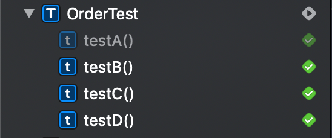
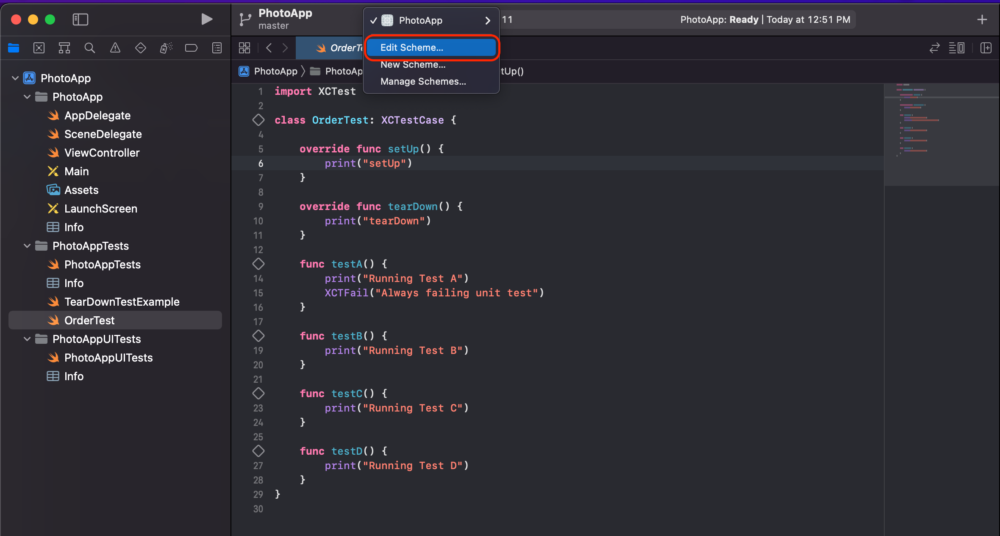

# Basics of Unit Testing in Xcode

유닛 테스트란
* 코드의 특정 부분을 테스트하기 위해 작성된 매우 작은 함수

```swift
func isEmailValid(email: String) -> Bool {
  // A function in the app needs to be tested
}
```
* 이메일의 유효성을 검증하는 함수가 있다고 가정하자
* 이 하나의 함수에도 여러 테스트를 작성할 수 있다
* 이메일 데이터를 인자로 보내고 있다
  - 여러 데이터 타입으로 테스트
  - 같은 데이터 타입이지만 내부 로직상 invalid한 인자로 테스트
* 결과가 의도한 Bool값이 나오는지 테스트

주의점
* 위와 같이 하나의 함수에 여러 테스트를 작성하는 것이 일반적이다
* 유닛 테스트를 여러 함수에 적용하려고 해서는 안된다
  - 유닛 테스트는 동시에 하나의 함수에만 적용해야 한다

Xcode Test Framework
* Xcode는 테스트를 위한 기능을 제공한다
* 작성한 테스트가 의도한대로 동작하는지 체크는 물론 성능까지 테스트해준다
* 통과한 테스트는 녹색으로, 통과하지 못한 테스트는 빨간색으로 표시된다

테스트 함수 예제
```swift
struct SignupFormModel {
  let firstName: String
  let lastName: String
  let email: String
  let password: String
  let repeatPassword: String
}

extension SignupFormModel {
  func isValidEmailFormat() -> Bool {
    return email.contains("@") && email.contains(".")
  }
}
```

```swift
func testSignUpFormModel_WhenCreated_EmailShouldHaveValidFormat() {
  // Arrange
  let email = "test@test.com"
  let signupFormModel = SignupFormModel(firstName: firstName, lastName: lastName, email: email, password: password, repeatPassword: repeatPassword)

  // Act
  let isEmailFormatValid = signupFormModel.isValidEmailFormat()

  // Assert
  XCTAssertTrue(isEmailFormatValid, "Provided valid email address does not have a valid format")
}
```

------

Testing Pyramid
* iOS 테스트에는 크게 세 종류가 있다

Unit Test
* 매우 작은 단위의 테스트로 코드의 특정 부분만 테스트한다 
* 데이터 베이스, 네트워크 통신 같은 외부 의존성이 없다
* 대신 Fake database나 Mock을 활용한다

Integration Test
* Fake database나 Mock이 아닌 실제 데이터베이스 혹은 네트워크 통신을 하면서 테스트한다

UI Test
* UI Interaction이나 Behavior를 자동화해서 테스트한다

------

F.I.R.S.T Principle
* 유닛 테스트에서 자주 사용되는 원칙이다

Fast
* 유닛 테스트는 Fake database나 Mock 같은 외부 의존성 없이 빠르게 테스트하는 것을 추구한다
* 코드의 일부분만 테스트하고 외부와 통신이 없으므로 속도가 빠르다

Independent
* 유닛 테스트 끼리는 서로 의존성을 가지지 않는다
* 유닛 테스트는 랜덤으로 실행될 수 있어야 한다

Repeatable
* 유닛 테스트는 여러 번 호출하든, 다른 컴퓨터(환경)에서 테스트하든 동일한 결과를 내야 한다
* 이 원칙을 지키려면 특정 환경이나 다른 유닛테스트에 종속된 테스트를 만들지 않아야 한다

Self-validating
* 테스트가 완료되고 나면, 테스트가 통과되든 통과되지 않든, 개발자가 추가적인체크 작업을 할 필요가 없어야 한다
* 유닛 테스트 자체만으로 성공인지 실패인지 판단할 수 있어야 한다

Thorough & Timely
* Thorough(철저함) : 엣지 케이스를 커버할 수 있는 테스트를 작성해야 한다
  - valid한 파라미터, invalid한 파라미터를 보냈을 때 의도한 대로 동작해야 한다
  - minimum, maximum 등 문제가 발생할 수 있을만한 상황을 최대한 배제하도록 테스트해야 한다
* Timely : 피쳐를 만드는 동안 테스팅을 수시로 해야 한다
  - 반복적으로 테스트가 성공하는 것을 확인하면서 개발중인 피쳐가 제대로 동작할지 도움을 얻을 수 있다

------

Test Driven Development
* 개발 프로세스를 구조화 하는 방법들 중 하나로, 코드를 먼저 작성하고 테스팅 하는 것이 아니라 테스트를 먼저 작성한 뒤 테스트를 통과하는 코드를 작성한다

TDD의 네 가지 스텝
* Red
  - 실패하는 테스트를 작성한다
  - 코드를 먼저 작성하기 전에 유닛 테스트를 작성하기 위해 거치는 절차다
  - 테스트가 실패하면 빨간색이 나오므로 Red라고 한다
* Green
  - 앞서 만들었던 실패하는 테스트를 통과시키는 절차다
  - 테스트가 성공하면 녹색이 나오므로 Green이라고 한다
* Refactor
  - 유닛 테스트 코드와 앱 코드 양쪽 모두 더 깔끔한 코드로 만드는 절차다
* Repeat
  - 위 단계를 모든 피쳐가 개발되고 테스트될 때까지 반복한다

------

The Default Unit Test Case Class Explained


* setUp 메서드는 각 유닛 테스트 함수가 실행되기 전에 호출된다
* 각 유닛 테스트 함수의 실행이 끝나면 tearDown 메서드가 호출된다
* 이 과정을 계속 반복한다
* setUp이나 tearDown을 class method로 override하면 첫 테스트 메서드가 호출될 때 딱 한 번만 호출된다


```swift
class PhotoAppTests: XCTestCase {
    override class func setUp() { // 첫 테스트 메서드가 호출될 때 한 번만 호출
        super.setUp()
    }

    override func setUpWithError() throws { // 테스트 메서드를 시작하기 전에 매번 호출
        // Put setup code here. This method is called before the invocation of each test method in the class.
    }

    override func tearDownWithError() throws { // 테스트 메서드가 끝날 때 매번 호출
        // Put teardown code here. This method is called after the invocation of each test method in the class.
    }

    override class func tearDown() { // 더 이상 테스트할 메서드가 없을 때 한 번만 호출
        super.tearDown()
    }

    func testExample() throws {
        // This is an example of a functional test case.
        // Use XCTAssert and related functions to verify your tests produce the correct results.
    }

    func testPerformanceExample() throws {
        // This is an example of a performance test case.
        self.measure {
            // Put the code you want to measure the time of here.
        }
    }

}
```

각 테스트 메서드에서 특정 값을 공유하기
* static 변수를 만들어 특정 값을 각 테스트 케이스에서 공유할 수 있다

```swift
class PhotoAppTests: XCTestCase {
    
    static var classInstanceCounter = 0
    
    override class func setUp() {
        super.setUp()
    }
    
    override func setUpWithError() throws {
        PhotoAppTests.classInstanceCounter += 1
    }

    override func tearDownWithError() throws {
        // Put teardown code here. This method is called after the invocation of each test method in the class.
    }
    
    override class func tearDown() {
        super.tearDown()
    }

    func testExample1() throws {
        print("Accessing class level information. Running from Instance # \(PhotoAppTests.classInstanceCounter)")
    }
    
    func testExample2() throws {
        print("Accessing class level information. Running from Instance # \(PhotoAppTests.classInstanceCounter)")
    }

    func testPerformanceExample() throws {
        // This is an example of a performance test case.
        self.measure {
            // Put the code you want to measure the time of here.
        }
    }

}
```

---

The addTeardownBlock()

유닛테스트가 끝났을 때
* 상태값을 초기화하거나 특정 자원을 해제해야 할 때가 있다
* 이 때 유닛테스트 함수에 addTeardownBlock를 추가할 수 있다

```swift
func testExample() throws {
  print("**** Test method is called")
  addTeardownBlock {
      // Called when testExample() ends.
      print("**** TeardownBlock is called when test method ends")
  }
}
```

setUp, tearDown 메서드들과 실행 순서 알아보기
```swift
import XCTest

class TearDownTestExample: XCTestCase {
    
    override class func setUp() {
        print("**** Class setUp() method is called") // 1.
    }

    override func setUpWithError() throws {
        print("**** Instance setUpWithError() method is called") // 2.
    }
    
    override class func tearDown() {
        print("**** Class tearDown() method is called") // 6.
    }
    
    override func tearDownWithError() throws {
        print("**** Instance tearDownWithError() method is called") // 5.
    }

    func testExample() throws {
       print("**** Test method is called") // 3.
        addTeardownBlock { // 4.
            // Called when testExample() ends.
            print("**** TeardownBlock is called when test method ends")
        }
    }

}
```
1. 클래스 메서드로 오버라이드한 setUp이 가장 먼저 호출된다
2. setUpWithError가 각 테스트 메서드가 호출되기 전에 매번 호출된다
3. 테스트 메서드(여기서는 testExample)이 호출된다
4. testExample안에 작성된 addTeardownBlock안의 코드가 호출된다
5. tearDownWithError가 각 테스트 메서드가 호출된 후에 매번 호출된다
6. 클래스 메서드로 오버라이드한 tearDown이 모든 테스트 메서드가 끝난 뒤에 호출된다

유저를 로컬 스토리지에 생성하고 테스트가 끝난 뒤 제거하는 예제
```swift
func testUserService_WhenGivenValidRecord_CanSuccessfullyPersistToStorage() throws {
        
  // Arrange
  let userRecord = User(firstname: "Sean", lastName: "Bae")
  
  // Act
  let storedRecord = sut.storeRecord(userRecord) // 1.
  
  addTeardownBlock {
      sut.deleteRecord(storedRecord) // 3.
  }
  
  // Assert
  XCTAssertNotNil(storedRecord) // 2.

}
```
1. 유저를 로컬 스토리지에 저장한다
2. XCTAssertNotNil로 저장한 유저가 있는지 체크한다
3. 테스트가 끝난 뒤 addTeardownBlock로 로컬 스토리지에 저장된 유저를 삭제한다

---

Creating a New Test Case Class

애플리케이션 코드를 사용하기
```swift
import XCTest
@testable import PhotoApp

class XXXTests: XCTestCase {
  // ...
}
```
* @testable import 애플리케이션 모듈 이름
  - 이 라인을 추가하면 애플리케이션에 있는 클래스 등 임포트한 모듈의 자원에 접근할 수 있다

---

Ways to Run Unit Test in Xcode

개별 메서드 실행

* Xcode에서 개별 테스트 메서드의 좌측에 있는 마름모를 누르면 해당 메서드만 테스트할 수 있다
* 만약 클래스 안에 다른 테스트 메서드가 있다면 클래스 옆의 마름모는 -인 상태일 것이다

테스트 네비게이터 이용하기


* 테스트 네비게이터에서도 동일하게 동작한다
* 테스트 케이스 목록을 보고 싶다면 네비게이터를 이용하는 것이 좋다

클래스 안의 모든 케이스가 테스트 된 경우

* 클래스의 모든 테스트 케이스가 통과되면 클래스 옆의 마름모가 녹색 체크 표시로 변경된다

---

The Default Order of Unit Tests

유닛 테스트의 실행 순서
* 기본적으로 엑스코드는 알파벳 순(혹은 렉시컬 순이라 한다)으로 테스트를 실행시킨다

```swift
import XCTest

class OrderTest: XCTestCase {

    override func setUp() {
        print("setUp")
    }
    
    override func tearDown() {
        print("tearDown")
    }

    func testA() {
        print("Running Test A")
    }

    func testB() {
        print("Running Test B")
    }
    
    func testC() {
        print("Running Test C")
    }
    
    func testD() {
        print("Running Test D")
    }
}
```
* testA, testB, testC, testD 순으로 실행된다
* 정확히는 setUp -> testA(B, C, D) -> tearDown 순으로 실행을 반복한다
* 만약 testD와 testA의 코드상 위치를 바꿔도 실행순서는 똑같다

---

Unit Test Naming Requirements

유닛 테스트 네이밍 필수사항들
1. 함수 이름은 test로 시작해야 한다
```swift
func testColorlsRed() {
  // Some code here
}
```
* 만약 이름이 test로 시작하지 않으면 엑스코드는 테스트를 실행하지 않는다

2. 테스트 메서드는 어떤 인자도 받지 않는다
3. 테스트 메서드는 어떤 값도 반환하지 않는다

베스트 프랙티스
* 반드시 따라야하는 것은 아니지만 다음과 같은 형식으로 유닛 테스트 이름을 작성하는 것이 좋다

```swift
func test<System Under Test>_<Condition Or State Change>_<Expected Result>() {
}
```
* 유닛 테스트는 함수 내부의 내용이 아니라 함수의 이름만 보고도 어떤 역할을 하는지 파악할 수 있어야한다

예시
```swift
func testSignupFormModel_WhenInformationProvided_PasswordShouldMatchRepeatPassword() {
}
```
* 물론 함수 이름이 너무 길다고 생각할 수도 있지만, 길어도 의미를 명확하게 전달하는 것이 더 좋다

---

Ways to Disable or Skip Unit Test

특정 유닛 테스트를 무시하도록 설정하기

* 무시할 메서드의 좌측 마름모를 우측 클릭하면 메뉴가 나온다
* Disabled "testA()"를 클릭하면 테스트할 때 해당 메서드를 제외시킬 수 있다

테스트 네비게이터에서 disabled된 테스트 메서드를 확인하기


스키마 수정하기 메뉴에서 disabled된 테스트 메서드를 확인하기
* 우선 좌측 상단의 앱 스키마를 클릭한다


* Edit scheme... 버튼을 누른다

Test -> Info 탭에서 확인할 수 있다

* 특정 테스트 메서드를 체크/해제하여 Enabled 혹은 Disabled 시킬 수 있다

생략할 테스트 메서드라면 skip_을 앞에 붙여주기

* 엑스코드도 test로 시작하지 않기 때문에 자동으로 제외시켜주고, 다른 개발자도 이 테스트 메서드는 생략한다는 것을 명확하게 알 수 있다

---

Viewing Test Results

테스트 결과를 확인하는 방법들
1. 콘솔에서 보기

```swift
func testA() {
    print("Running Test A")
    XCTFail("Always failing unit test")
}
```
* 우선 한 테스트를 항상 실패하도록 만든다
* 테스트를 돌린 후 다음 스크린샷과 동일한 메뉴를 찾아 선택한다


* 콘솔에서 테스트 결과를 자세히 확인할 수 있다

---

2. 테스트 네비게이터에서 보기
* 성공 및 실패 목록을 한눈에 볼 수 있다


--- 

3. 테스트 리포트를 확인하기
* 그동안 테스트를 돌렸던 결과들을 볼 수 있다


---

Code coverage

코드 커버리지 옵션


* 화면의 Scheme Editor에서 Edit Scheme을 클릭한다 


* Test의 Options로 들어가 Code Coverage 옵션 옆의 체크박스를 활성화시킨뒤 Close 버튼을 눌러 창을 닫는다
* 이제부턴 유닛 테스트를 돌릴 때마다 Xcode가 여러 데이터를 수집해서 코드 커버리지 리포트를 생성해 줄 것이다


* 테스트를 실행하고 Report Navigator에서 테스트마다 각 파일의 Coverage를 확인할 수 있다


* 특정 파일에 들어가면 테스트를 위해 각 부분이 몇번씩 호출되었는지 숫자가 표기된다
* 테스트가 통과되었을 시 사진과 같이 녹색이 뜨며, 실패할 시 빨간색이 뜬다

100% Code coverage
* 코드 커버리지가 100%에 도달했다고해서 애플리케이션에 버그가 없고 완벽하게 작동할 것이라고 생각해서는 안된다
* 어디까지나 작성된 테스트 코드 안에서 문제가 없는 것이며 파악하지 못한 문제가 발생할 수 있다
* 코드 커버리지 수치에 집중하기 보다는 빠뜨린 부분은 없는지를 생각하며 철저하게 테스트를 작성하기 위해 노력해야 한다

---

Test Method Code Structure. Arrange, Act, Assert

읽기 쉬운 테스트 메서드 작성하기(AAA)
* 테스트 메서드의 각 부분을 나눠서 규칙성있게 작성하면 관리가 쉬워진다

```swift
func testSignupFormModel_WhenInformationProvided_PasswordsShouldMatch() {

  // Arrange(Given)
  let firstName = "Eonsu"
  let lastName = "Bae"
  let email = "eonsubae@gmail.com"
  let password = "12345678"
  let repeatPassword = "12345678"
  let sut = SignupFormModel(firstName: firstName, lastName: lastName, email: email, password: password, repeatPassword: repeatPassword)

  // Act(When)
  let passwordsMatch = sut.doPasswordsMatch()

  // Assert(Then)
  XCTAssertTrue(passwordsMatch, "Expected TRUE value for 'passwordsMatch' but apparently it is FALSE")
}
```
* Arrange는 테스트에 필요한 모든 멤버변수를 작성하는 곳이다
* Act는 테스트하려는 함수를 실제로 호출하는 곳이다. 검증을 위해 함수의 반환값을 저장하기도 한다
* Assert는 테스트 결과 통과되었는지 실패인지를 검증하는 곳이다. 
  - XCTAssertTrue는 검증값이 true이길 기대하는 검증함수다
  - 검증결과가 false이면 두 번째 인자의 문장이 출력된다. 이 두 번째 인자는 옵셔널이지만 추가해주는 것이 더 좋은 습관이다.

---

Assertions

```swift
func testSignupFormModel_WhenInformationProvided_PasswordsShouldMatch() {

  // Arrange(Given)
  let firstName = "Eonsu"
  let lastName = "Bae"
  let email = "eonsubae@gmail.com"
  let password = "12345678"
  let repeatPassword = "12345678"
  let sut = SignupFormModel(firstName: firstName, lastName: lastName, email: email, password: password, repeatPassword: repeatPassword)

  // Act(When)
  let passwordsMatch = sut.doPasswordsMatch()

  // Assert(Then)
  XCTAssertTrue(passwordsMatch, "Expected TRUE value for 'passwordsMatch' but apparently it is FALSE", file: "SignupFormModelTests.swift", line: 36)
}
```
* XCTAssertTrue에는 추가로 두 가지 인자를 작성할 수 있다(옵셔널)
* file을 추가하면 테스트 케이스가 실패했을 때 어느 파일에서 실패한 것인지 보다 쉽게 파악할 수 있어 추가해주는 것이 좋다
* line을 추가하는 것도 마찬가지다

## Various Assertions

### Boolean Test Assertions

검증값이 참이거나 거짓이길 기대하는 함수

* XCTAssertTrue : XCTAssertTrue(expression, "optional description") 검증 값이 True이길 기대하는 함수
* XCTAssertFalse : XCTAssertFalse(expression, "optional description") 검증 값이 False이길 기대하는 함수

### Nil Test Assertions

검증값이 nil이거나 nil이 아니길 기대하는 함수

* XCTAssertNil : XCTAssertNil(expression, "optional description") 검증 값이 nil이길 기대하는 함수
* XCTAssertNotNil: XCTAssertNotNil(expression, "optional description") 검증 값이 nil이 아니길 기대하는 함수
* XCTUnwrap: 검증값이 nil이 아니고, 래핑되지 않은 값을 반환하길 기대하는 함수

### Equality Test Assertions

두 값의 관계를 검증하는 함수

* XCTAssertEqual : XCTAssertEqual(expression1, expression2, "optional description") 두 값이 일치하길 기대하는 함수
* XCTAssertNotEqual : XCTAssertNotEqual(expression1, expression2, "optional description") 두 값이 불일치하길 기대하는 함수
* XCTAssertGreaterThan : XCTAssertGreaterThan(expression1, expression2, "optional description") 한 값이 다른 값보다 크기를 기대하는 함수
* XCTAssertLessThan : XCTAssertLessThan(expression1, expression2, "optional description") 한 값이 다른 값보다 작기를 기대하는 함수
* XCTAssertLessThanOrEqual : XCTAssertLessThanOrEqual(expression1, expression2, "optional description") 한 값이 다른 값보다 작거나 같기를 기대하는 함수
* XCTAssertEqualWithAccuracy : XCTAssertEqualWithAccuracy(expression1, expression2, accuracy, "optional description") 두 값이 일정 범위 안에서 일치하기를 기대하는 함수

XCTAssertEqualWithAccuracy는 deprecated되었지만 조금 다른 방식으로 사용되고 있다
* XCTAssertEqual(49.2827, 49.2826, accuracy: 0.001)
  - 두 값이 0.001이라는 오차 안에서 일치하기를 기대하는 함수다
  - longitude, latitude처럼 일정 오차를 허용해야 하는 값을 검증할 때 유용하다

### Unconditional Failure

값의 검증과 무관하게 즉시 실패를 반환하는 함수

* XCTFail : XCTFail("optional description") 상태에 관계없이 호출되는 즉시 실패한다

아래 예제와 같은 상황에서 사용할 수 있다

```swift
func testSignupFormValidator_WhenIlligalCharacterUsedInPassword_ShouldThrowError() {
  // Arrange(Given)
  let signupFormModel = SignupFormModel(firstName: "Eonsu", 
                                        lastName: "Bae", 
                                        email: "eonsubae@gmail.com", 
                                        password: "12345678", 
                                        repeatPassword: "12345678")
  let sut = SignupFormValidator(formModel: SignupFormModel)                

  // Act(When)
  do {
    _ = try sut.isValidPassword()
    XCTFail("Provided password contains an illegal character but an error was not thrown.")
  } catch {
    // Assert(Then)
    XCTAssertEqual(error as? AppErrors, AppErrors.PasswordContainsIlligalCharacter, "An error took place but not the one expected. Expected error is PasswordContainsIlligalCharacter")
  }
}
```
* password가 정책상 허용될 수 없는 값임에도 통과되었다면 즉시 실패시키기 위해 사용하고 있다

### Exception Tests

검증값이 예외를 발생시키는지 검증하는 함수

* XCTAssertThrowsError : XCTAssertThrowsError(expression, "optional description") expressions이 에러를 발생시키기를 기대하는 함수
* XCTAssertNoThrow : XCTAssertNoThrow(expression, "optional description") expressions이 에러를 발생시키지 않기를 기대하는 함수

```swift
func testSignupFormValidator_WhenIlligalCharacterUsedInPassword_ShouldThrowError() {
  // Arrange(Given)
  let signupFormModel = SignupFormModel(firstName: "Eonsu", 
                                        lastName: "Bae", 
                                        email: "eonsubae@gmail.com", 
                                        password: "1234567{8}", // Invalid character 
                                        repeatPassword: "12345678")
  let sut = SignupFormValidator(formModel: SignupFormModel)                

  // Act(When) and Assert(Then)
  XCTAssertThrowsError(try sut.isValidPassword(), "A PasswordContainsIlligalCharacter Error should have been thrown but no Error was thrown") { error in
    XCTAssertEqual(error as? AppErrors, AppErrors.PasswordContainsIlligalCharacter, "An error took place but not the one expected. Expected error is PasswordContainsIlligalCharacter")
  }
}
```
* password에 부적절한 문자가 포함되어 있으므로 sut.isValidPassword()가 에러를 발생시키길 기대한다(XCTAssertThrowsError)
  - 만약 에러가 발생하지 않으면 테스트는 실패한다
* 에러가 발생하면 클로저로 해당 에러를 추가적으로 검증할 수 있다
  - 여기서는 발생한 에러가 AppErrors.PasswordContainsIlligalCharacter와 같은지를 검증하고 있다